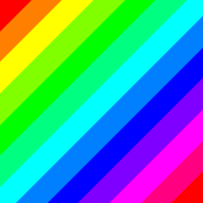

# Square-Keemon



Draws a square containing a customizable rainbow gradient.

## Installation

To install, you can use your favorite package manager, for example `yarn` or `npm`. We recommend npm.

```
npm install square-keemon
```

## Usage

```jsx
<Square [size] [direction] [smooth]>
```

- `size`: How long each side of this Square will be, in pixels.
- `direction`: In which direction(s) the rainbow gradient will flow. Usable letters:

  ```
  H: Horizontal
  V: Vertical
  D: Diagonal
  L: Left to Right
  T: Top to Bottom
  R: Right to Left
  B: Bottom to Top
  ```

  - No spacing nor separation is required.
  - It is **not** recommended to put `L` and `R` in the same direction string, nor `T` and `B`.
  - `H` & `V` do not work with `smooth`.

- `smooth`: Whether the rainbow gradient will be rendered with parallel or perpendicular separators.
